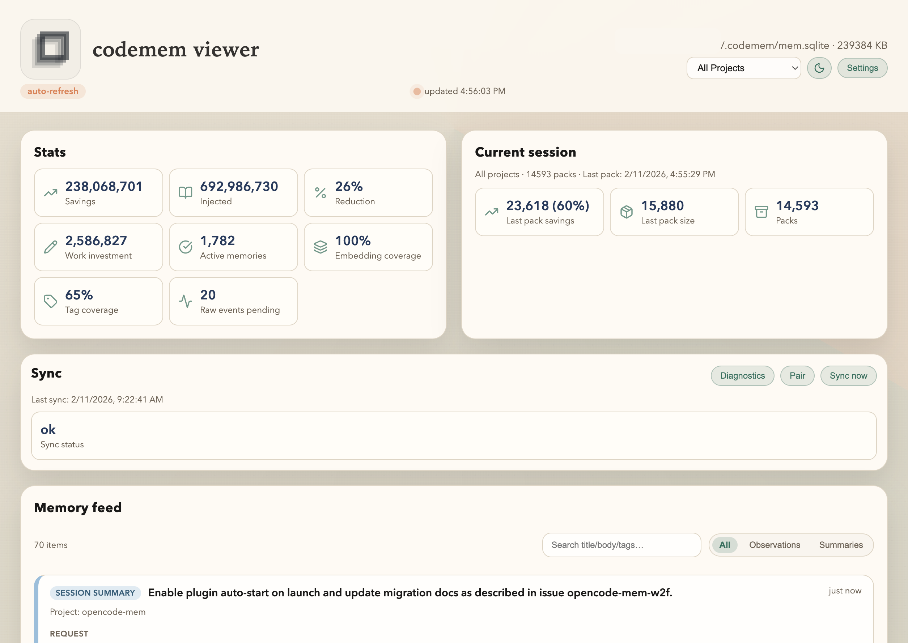

# codemem

[](https://github.com/kunickiaj/codemem/actions/workflows/ci.yml) [](https://codecov.io/gh/kunickiaj/codemem) [](https://github.com/kunickiaj/codemem/releases)

A lightweight persistent-memory companion for OpenCode. Captures terminal sessions (and tool calls) as memories, serves a viewer, and exposes an OpenCode plugin that records tool usage automatically.

## Why codemem

- Persistent cross-session memory for coding agents, stored locally in SQLite
- Built-in viewer for memory feed, session history, and observer tuning
- Peer-to-peer sync so your memory graph can travel across machines without a central service
- OpenCode-native plugin + MCP tools for low-friction usage in daily workflows

## What it looks like



## Prerequisites

- Python 3.11+
- [uv](https://docs.astral.sh/uv/) (recommended) or pip

## Get started in 60 seconds

1) Install the CLI:

```bash
uv tool install --upgrade codemem
```

2) Add the plugin in OpenCode config (`~/.config/opencode/opencode.jsonc`):

```json
{
  "$schema": "https://opencode.ai/config.json",
  "plugin": ["@kunickiaj/codemem"]
}
```

3) Restart OpenCode, then verify:

```bash
codemem stats
codemem raw-events-status
```

If you are migrating from `opencode-mem`, use the step-by-step checklist in
`docs/rename-migration.md`.

## Alternative install paths

SSH access is only needed for git-based fallback installs.

### For local development

```bash
# Create virtual environment and install with dependencies
uv sync

# Run commands via the venv
.venv/bin/codemem --help

# Or activate the venv first
source .venv/bin/activate  # bash/zsh
source .venv/bin/activate.fish  # fish
codemem --help
```

### Via uvx (no install)

Run directly without installing:

```bash
# Run latest
uvx --from git+ssh://git@github.com/kunickiaj/codemem.git codemem stats

# Run specific version
uvx --from git+ssh://git@github.com/kunickiaj/codemem.git@v0.9.17 codemem stats

# Run from local clone
uvx --from . codemem stats
```

### Install from GitHub

```bash
# Install latest
uv pip install git+ssh://git@github.com/kunickiaj/codemem.git

# Install specific version
uv pip install git+ssh://git@github.com/kunickiaj/codemem.git@v0.9.17
```

### Configuration

Optionally point the SQLite store somewhere else:

```bash
export CODEMEM_DB=~/.codemem/mem.sqlite
```

## CLI commands

- `codemem init-db` – initialize the database.
- `codemem stats` / `codemem recent` / `codemem search` – inspect stored memories.
- `codemem embed` – backfill semantic embeddings for existing memories.
- `codemem db prune-memories` – deactivate low-signal memories (use `--dry-run` to preview).
- `codemem serve` – launch the web viewer (the plugin also auto-starts it).
- `codemem export-memories` / `codemem import-memories` – export and import memories by project for sharing or backup.
- `codemem sync` – enable peer sync, pair devices, and run the sync daemon.

## Runtime hook behavior (plugin)

- The plugin captures tool activity via `tool.execute.after` and conversation messages from event payloads.
- Flush boundaries are event-driven: `session.idle`, `session.created`, `/new` prompt, and `session.error`.
- Force-flush triggers fire on heavy sessions: `>=50` tools, `>=15` prompts, or `>=10m` session duration.
- Raw events are delivered to the viewer ingest API (`/api/raw-events`).

For usage and troubleshooting details, see `docs/user-guide.md` and `docs/plugin-reference.md`.

### Sync project filters

By default, sync replicates all projects. You can restrict which projects a device will apply by
project basename (folder name).

Config keys (in `~/.config/codemem/config.json`):

```json
{
  "sync_projects_include": ["codemem"],
  "sync_projects_exclude": ["work-repo"]
}
```

Notes:
- If `sync_projects_include` is non-empty, only those projects sync.
- `sync_projects_exclude` always wins.
- Filtering is reversible: excluded projects are skipped without advancing cursors, so toggling
  filters later will allow previously filtered ops to sync.

#### Per-peer overrides (recommended for coworker sync)

Global filters apply to all peers by default. When accepting a pairing payload, you can set a
per-peer override so one peer only syncs shared work projects while your other devices still sync
everything.

Example:

```bash
# Accept a peer and only sync specific projects with them
codemem sync pair --accept '<payload>' --include shared-repo-1,shared-repo-2

# Accept a peer and exclude a project
codemem sync pair --accept '<payload>' --exclude private-repo

# Clear per-peer override (inherit global defaults)
codemem sync pair --accept '<payload>' --default

# Force per-peer override to sync all projects with this peer
codemem sync pair --accept '<payload>' --all
```

## Semantic recall

Semantic recall stores vector embeddings for memory items using sqlite-vec and fastembed. Embeddings are written when memories are created; use `codemem embed` to backfill existing memories.

Notes:
- Requires a Python SQLite build that supports extension loading (sqlite-vec).
- If sqlite-vec cannot load, semantic recall is skipped and keyword search still works.

### sqlite-vec on aarch64 (Linux)

The PyPI wheels for sqlite-vec currently ship a 32-bit `vec0.so` on aarch64, which fails to load in 64-bit Python with `ELFCLASS32`. Use the aarch64 release build instead:

```bash
# Download the aarch64 loadable extension (0.1.7a2)
curl -L -o /tmp/sqlite-vec-0.1.7a2-linux-aarch64.tar.gz \
  https://github.com/asg017/sqlite-vec/releases/download/v0.1.7-alpha.2/sqlite-vec-0.1.7-alpha.2-loadable-linux-aarch64.tar.gz

# Extract and replace the bundled vec0.so inside the venv
tar -xzf /tmp/sqlite-vec-0.1.7a2-linux-aarch64.tar.gz -C /tmp
cp /tmp/vec0.so .venv/lib/python*/site-packages/sqlite_vec/vec0.so
```

This keeps sqlite-vec installed but swaps in a 64-bit aarch64 loadable, unblocking vector search and imports on Debian 13 arm64.

## Exporting and importing memories

Share your project knowledge with teammates or back up memories to transfer between machines.

### Export memories

```bash
# Export all memories for current project
codemem export-memories myproject.json

# Export a specific project
codemem export-memories myproject.json --project /path/to/myproject

# Export all projects
codemem export-memories all.json --all-projects

# Export including deactivated memories
codemem export-memories myproject.json --project myproject --include-inactive

# Export to stdout and compress
codemem export-memories - --project myproject | gzip > myproject.json.gz

# Export memories from a specific date
codemem export-memories recent.json --project myproject --since 2025-01-01
```

### Import memories

Imports are idempotent. You can safely re-run the same import file to pick up
new entries without duplicating existing data.

```bash
# Preview what will be imported (dry run)
codemem import-memories myproject.json --dry-run

# Import memories
codemem import-memories myproject.json

# Import with project remapping (teammate has different paths)
codemem import-memories myproject.json --remap-project /Users/teammate/workspace/myproject

# Import from compressed file
gunzip -c myproject.json.gz | codemem import-memories -
```

### Import from claude-mem

Use the claude-mem SQLite database directly (not the JSON export).
Imports are idempotent, so re-running is safe.

```bash
codemem import-from-claude-mem ~/.claude-mem/claude-mem.db
```

### Use case: sharing knowledge with teammates

When a teammate joins your project:

```bash
# You: export your project memories
codemem export-memories project-knowledge.json --project myproject

# Share the file (Slack, email, git, etc.)

# Teammate: import into their codemem
codemem import-memories project-knowledge.json --remap-project ~/workspace/myproject
```

Now their LLM has access to all your discoveries, patterns, and decisions about the codebase.

## Contributing

Contributor setup, tests, linting, and release workflow live in `CONTRIBUTING.md`.

## Configuration

Configuration is stored in `~/.config/codemem/config.json` (override with `CODEMEM_CONFIG`). Environment variables always take precedence.

### Sync quickstart (Phase 2)

```bash
# Enable sync (generates device keys)
codemem sync enable

# Start daemon (foreground)
codemem sync daemon
```

Pair on device A (CLI or viewer UI QR):

```bash
codemem sync pair
```

Copy the payload to device B:

```bash
codemem sync pair --accept '<payload>'
```

Status and one-off sync:

```bash
codemem sync status
codemem sync once
```

Autostart (macOS + Linux):

```bash
codemem sync install
```

Relevant config keys (override with env vars):

- `sync_enabled` / `CODEMEM_SYNC_ENABLED`
- `sync_host` / `CODEMEM_SYNC_HOST`
- `sync_port` / `CODEMEM_SYNC_PORT`
- `sync_interval_s` / `CODEMEM_SYNC_INTERVAL_S`
- `sync_mdns` / `CODEMEM_SYNC_MDNS`
- `sync_key_store` / `CODEMEM_SYNC_KEY_STORE` ("file" or "keychain")

Note: macOS keychain storage uses the `security` CLI and may expose the key via process arguments. Keep `sync_key_store=file` if that’s a concern.

The viewer includes a Settings modal for the observer provider, model, and max chars. Changes write to the config file; environment variables still override those values.

## Docs

- `docs/architecture.md` covers the data flow and components.
- `docs/user-guide.md` covers viewer usage and troubleshooting.
- `docs/plugin-reference.md` covers plugin behavior, env vars, and stream reliability knobs.
- `docs/rename-migration.md` covers migration from `opencode-mem` to `codemem`.
- `CONTRIBUTING.md` covers contributor setup, testing, and release workflow.

## OpenCode MCP setup

To let the LLM call memory tools (search/timeline/pack), run:

```bash
codemem install-mcp
```

This writes/updates your global OpenCode config at `~/.config/opencode/opencode.json`. The MCP entry looks like:

```json
{
  "$schema": "https://opencode.ai/config.json",
  "mcp": {
    "codemem": {
      "type": "local",
      "command": ["uvx", "codemem", "mcp"],
      "enabled": true
    }
  }
}
```

Restart OpenCode and the MCP tools will be available to the model.

## Plugin mode

### Installation

**Recommended (npm package):**

Add `@kunickiaj/codemem` to your OpenCode plugin config, then restart OpenCode.

```json
{
  "$schema": "https://opencode.ai/config.json",
  "plugin": ["@kunickiaj/codemem"]
}
```

Notes:
- The key is `plugin` (singular). `plugins` is rejected as an unknown key.
- To pin a specific plugin release, use `"@kunickiaj/codemem@0.9.20"`.

**Git fallback one-liner** (advanced):

```bash
uvx --from git+ssh://git@github.com/kunickiaj/codemem.git codemem install-plugin
```

That's it! Restart OpenCode and the plugin is active.

**For development** (working on codemem):

Just start OpenCode inside the repo directory — the plugin auto-loads from `.opencode/plugin/`.

### How it works

When OpenCode starts, the plugin loads and:

1. **Auto-detects mode**:
   - If in the `codemem` repo → uses `uv run` (dev mode, picks up changes)
   - Otherwise → uses `uvx --from git+ssh://...` (installed mode)

2. Tracks every tool invocation (`tool.execute.after`)
3. Flushes captured events on session boundaries (`session.idle`, `session.created`, `/new`, `session.error`)
4. Auto-starts the viewer by default (set `CODEMEM_VIEWER_AUTO=0` to disable)
5. Injects a memory pack into the system prompt (disable with `CODEMEM_INJECT_CONTEXT=0`)

Observer/settings panel and advanced plugin controls are documented in `docs/plugin-reference.md`.
